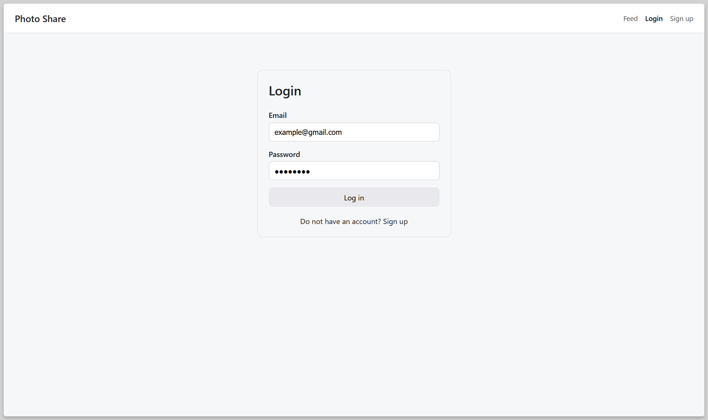
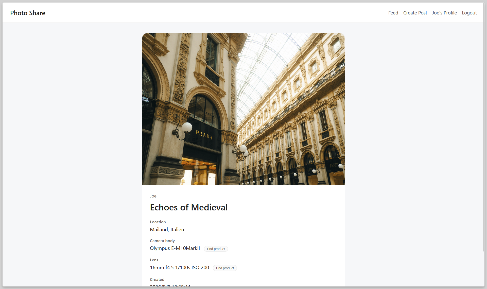
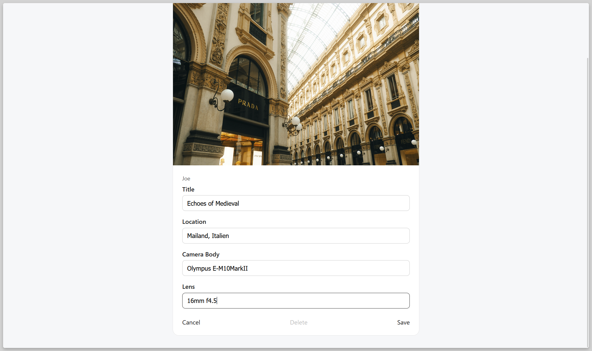
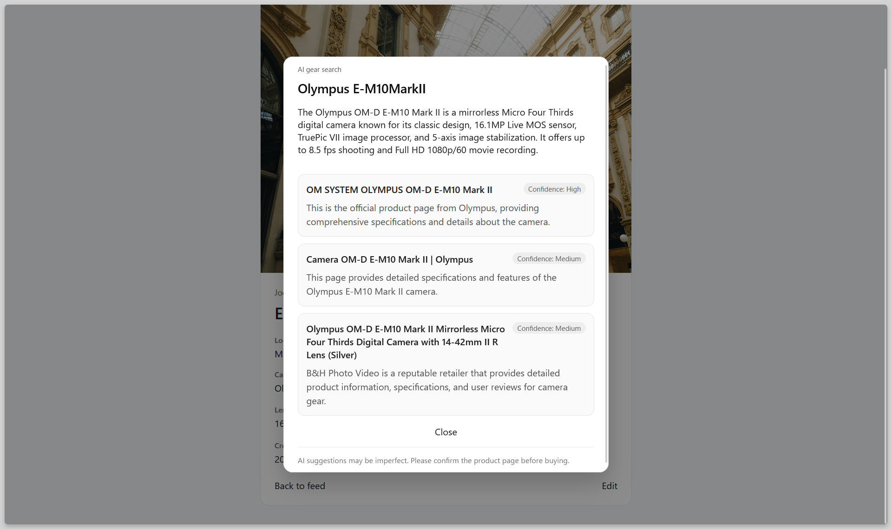

English | [日本語](./readme.ja.md)

# Photo Share

Photo Share is a full-stack photo-sharing web application built with Go, React, TypeScript, and PostgreSQL.

Users can sign up, log in, create photo posts, upload images, add caption/location/camera/lens metadata, view a public feed, view individual posts, view user profiles, and edit or delete their own posts.

The project also includes an AI-powered gear link assistant that helps users find product/spec links for camera bodies and lenses mentioned in posts.

## Features

- User signup and login
- JWT-based authentication
- Create photo posts with uploaded images
- Add caption, location, camera body, and lens metadata
- View a feed of recent posts
- View individual post detail pages
- View user profile pages
- Edit and delete owned posts
- Protected routes for authenticated actions
- AI gear link assistant for camera/lens product suggestions
- OpenAPI-documented backend API

## Tech Stack

### Frontend

- React
- TypeScript
- React Router
- Vite
- CSS

### Backend

- Go
- PostgreSQL
- go-jet
- goose migrations
- JWT authentication
- OpenAPI

### AI Integration

- Backend-only AI API integration
- Structured JSON responses for gear link suggestions

### Development Tools

- Git / GitHub
- VS Code
- curl for API testing

## Architecture

The project is split into a frontend, backend, database, and OpenAPI contract.

```text
photo-share/
  backend/
    cmd/server/              # Go server entry point
    internal/handler/        # HTTP handlers
    internal/service/        # Business logic
    internal/repository/     # Database queries
    internal/middleware/     # Auth, CORS, logging, recovery
    internal/db/             # Database generated models
    internal/dto/            # Shared data transfer objects
    internal/config/         # Environment/config loading
    internal/httpx/          # Shared response writer utility
    internal/storage/        # Local storage for uploaded images
    migrations/              # goose migration files

  frontend/
    src/
      api/                   # API client functions
      auth/                  # Global auth state
      components/            # Reusable UI components
      pages/                 # Route-level page components
      routes/                # Route protection wrappers
      types/                 # TypeScript types
      utils/                 # Helper functions

  openapi/
    openapi.yaml             # API contract

  docs/
    screenshots/             # README screenshots
```

## Local Setup

### Prerequisites

Install the following first:

- Go
- Node.js and npm
- PostgreSQL
- goose
- Git

### 1. Clone the repository

```bash
git clone https://github.com/minarai7/photo-share
cd photo-share
```

### 2. Set up the backend environment

```bash
cd backend
cp .env.example .env
```

Edit `backend/.env` and set your local database URL, JWT secret, upload directory, and AI API key.

### 3. Create the PostgreSQL database

Create the database named in `DATABASE_URL`. Example using `psql`:

```bash
createdb -U <your-postgres-username> <your-database-name>
```

### 4. Run database migrations

From the `backend` folder:

```bash
goose -dir migrations postgres <your-database-url> up
```

### 5. Install backend dependencies

```bash
go mod download
```

### 6. Start the backend server

```bash
go run ./cmd/server
```

The backend should start on:

```text
http://localhost:8080
```

You can test it with:

```bash
curl http://localhost:8080/health
```

Expected response:

```json
{
  "status": "ok"
}
```

### 7. Set up the frontend environment

Open a new terminal.

```bash
cd frontend
cp .env.example .env
```

Make sure `frontend/.env` contains:

```env
VITE_API_BASE_URL=http://localhost:8080
```

### 8. Install frontend dependencies

```bash
npm install
```

### 9. Start the frontend dev server

```bash
npm run dev
```

The frontend should start on a local Vite URL, usually:

```text
http://localhost:5173
```

## API Notes

The backend API is documented with OpenAPI.

Main endpoint groups:

```text
auth:
  POST /auth/signup
  POST /auth/login
  GET  /users/{id}

posts:
  GET    /posts
  GET    /posts/{id}
  POST   /posts
  PUT    /posts/{id}
  DELETE /posts/{id}

uploads:
  POST /uploads

ai:
  POST /ai/gear-link
```

Protected endpoints require a Bearer token:

```http
Authorization: Bearer <token>
```

The OpenAPI spec is located at:

```text
openapi/openapi.yaml
```

## Screenshots

### Login



### Feed


### Post Detail



### Edit Post



### Profile


### AI Gear Link Assistant



## Demo Video

A short demo video showing feed browsing, signup, login, profile page, post creation, post edit, AI gear link suggestions, and post delete is available here:

[Watch the demo](https://minarai7.github.io/photo-share/)

## Future Improvements

- Add structured response for ai gear link
- Deploy the frontend and backend
- Store uploaded images in cloud storage such as S3
- Add comments and likes
- Add post search and filtering
- Add pagination or infinite scrolling to the feed
- Improve AI gear link accuracy with caching and stricter source validation
- Add automated backend and frontend tests
- Add refresh tokens or cookie-based authentication

## Development Notes

This project uses a layered backend architecture:

- Handlers parse HTTP requests and return HTTP responses.
- Services contain business logic.
- Repositories handle database access.
- Middleware handles cross-cutting concerns such as authentication, CORS, logging, and panic recovery.

The frontend uses a dedicated API layer so page components do not directly hardcode fetch logic everywhere.
