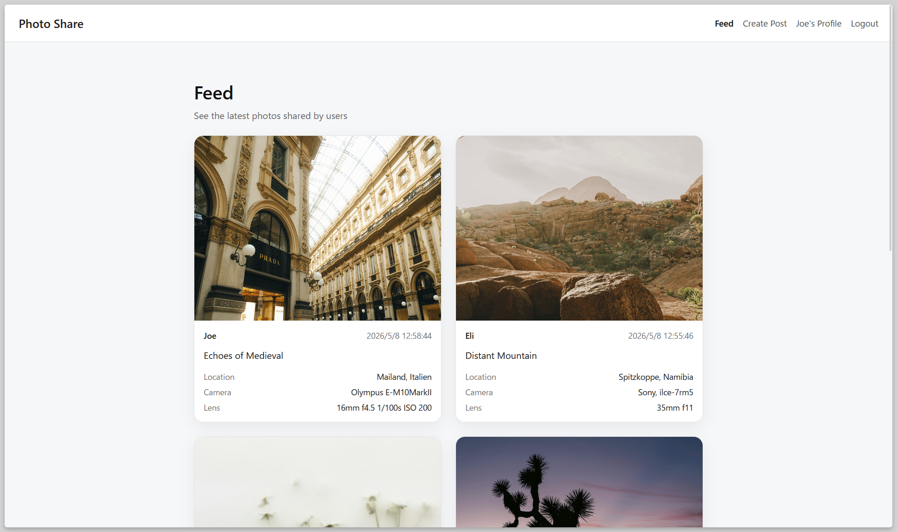
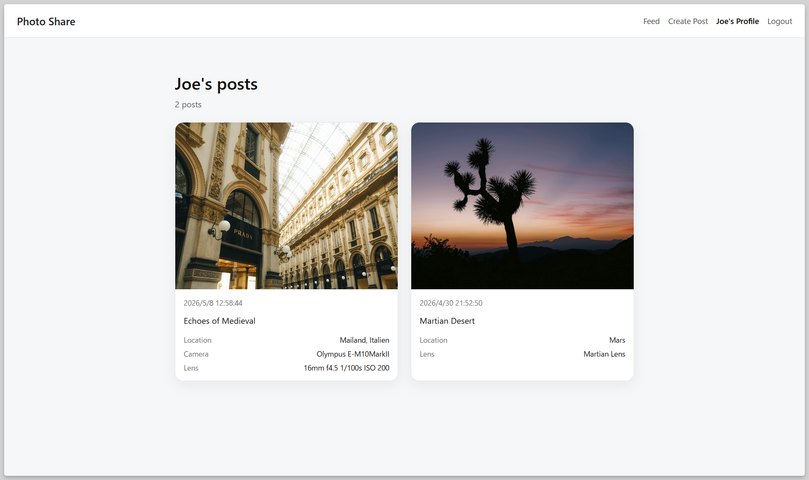

# Photo Share

Photo Share is a full-stack photo-sharing web application built with Go, React, TypeScript, and PostgreSQL.

Users can sign up, log in, create photo posts, upload images, add caption/location/camera/lens metadata, view a public feed, view individual posts, view user profiles, and edit or delete their own posts.

The project also includes an AI-powered gear link assistant that helps users find product/spec links for camera bodies and lenses mentioned in posts.

## Features

- User signup and login
- JWT-based authentication
- Create photo posts with uploaded images
- Add caption, location, camera body, and lens metadata
- View a feed of recent posts
- View individual post detail pages
- View user profile pages
- Edit and delete owned posts
- Protected routes for authenticated actions
- AI gear link assistant for camera/lens product suggestions
- OpenAPI-documented backend API

## Tech Stack

### Frontend

- React
- TypeScript
- React Router
- Vite
- CSS

### Backend

- Go
- PostgreSQL
- go-jet
- goose migrations
- JWT authentication
- OpenAPI

### AI Integration

- Backend-only AI API integration
- Structured JSON responses for gear link suggestions

### Development Tools

- Git / GitHub
- VS Code
- curl for API testing

## Screenshots

### Feed

### Post Detail

### Edit Post

### Profile

### AI Gear Link Assistant

